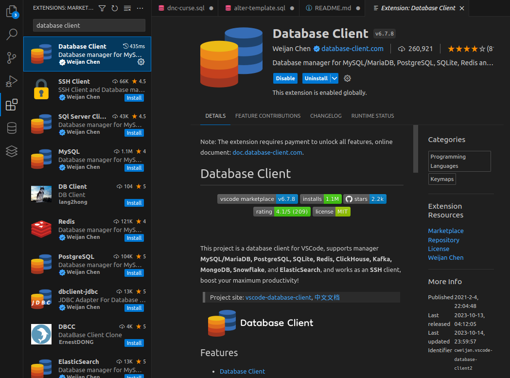
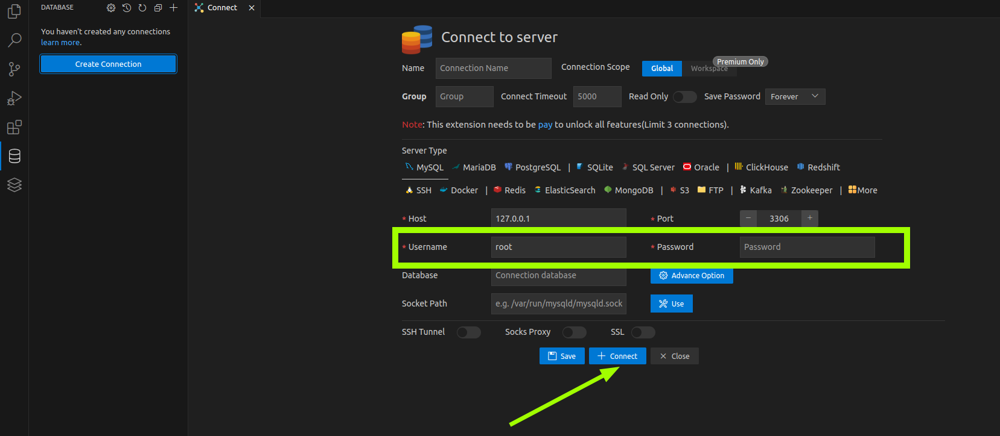
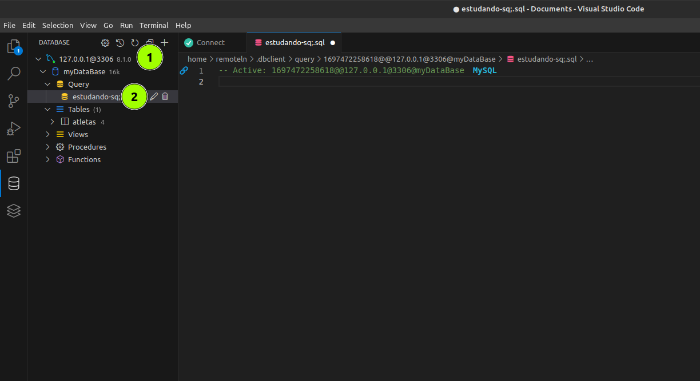

# Aprenda a sintaxe do sql e administre seus bancos de dados 

Lista com os principais comandos em sql para criar banco de dados e editar suas tabelas.

## ⬇️ Rodando o projeto

## 1. Instale o docker engine no seu computador

Suba um container de sql com o seguinte comando. No exemplo abaixo estamos utilizando o linux como sistema operacional

> sudo docker run --name nomeDaImagem -e MYSQL_ROOT_PASSWORD=suaSenha -p 3306:3306 -d mysql

Após baixar a imagem de um start no container com o seguinte comando:

> sudo docker start nomeDaImagem

### 2. Instale a extensão database client no vs code.

### 3. Crie uma conexão utilizando a extensão database client

A senha a ser utilizada é a mesma que você definiu quando criou a imagem no passo 1

### 4. Crie um banco de dados e faca sua query conforme desejado

Agora é criar um banco de dados e cria uma Query, dessa forma você pode utilizar a extensão afim de estudar o sql a parte de qualquer outro código.

## 🖥️ Tecnologías Utilizadas

          

         
## 🤔 Aprendizados

Aprender a sintaxe pura do sql de forma intuitiva e sem frameworks ou outra linguagem.

## 🖧 Vamos nos conectar?

  
  
  
  
  

## Click no link abaixo para ver

## [Aprendendo a sintaxe! ](/sql-sintaxe.md)
